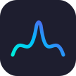
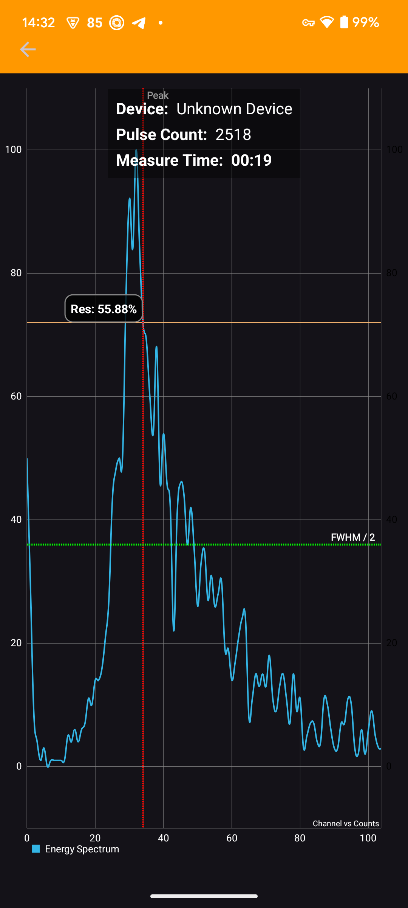

|  | OGK Inspector |
|--------------------------------------------------------------------------------------|---------------|

OGK Inspector is the official Android companion app for the [OpenGammaKit](https://github.com/vikulin/OpenGammaKit) spectrometers, built to interface with supported hardware via USB serial (compatible with Android 7.0 and above). Designed for precision calibration and spectrometer diagnostics, it now features enhanced integration with the latest calibration code updates and a **comprehensive isotopes database** for improved calibration accuracy.

## Key Features
- **Real-time gamma spectrum visualization** with improved accuracy
- **Optimized resolution (FWHM) calculation** reflecting calibration refinements
- **Advanced troubleshooting terminal** for direct spectrometer command execution
- **Common isotopes database** for streamlined calibration and isotope identification
- **Comprehensive system diagnostics** with detailed calibration status insights

Ideal for developers, technicians, and researchers working with OpenGammaKit-based spectrometers who require precise calibration workflows and real-time spectral analysis.

   
  

