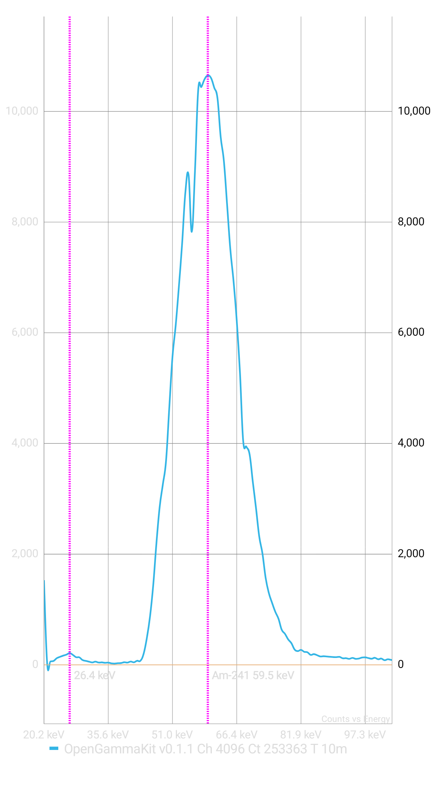

|  | OGK Inspector |
|--------------------------------------------------------------------------------------|---------------|

**OGK Inspector** is the official Android companion app for [OpenGammaKit](https://github.com/vikulin/OpenGammaKit) spectrometers, designed to interface with supported hardware via USB serial (compatible with Android 7.0+). Built for high-precision diagnostics and calibration workflows, it now includes advanced signal processing tools such as Savitzky-Golay filtering and wavelet-based peak detection.

---

## 🔧 Key Features

- **Counter Mode**  
  Real-time tracking of counts per second (CPS) for continuous monitoring.

- **Threshold Alerting**  
  Audible alarms and visual indicators when radiation thresholds are exceeded.

- **Real-Time Gamma Spectrum Visualization**  
  High-resolution spectrum plotting with dynamic chart updates and enhanced calibration accuracy.

- **Savitzky-Golay Filtering**  
  Polynomial smoothing applied to spectral data to reduce noise while preserving peak shape.

- **Wavelet-Based Peak Detection (CWT)**  
  Advanced peak detection using Continuous Wavelet Transform, including:
  - Multi-scale analysis
  - Automatic noise estimation
  - Peak grouping by proximity
  - Support for baseline correction

- **Spectrum Chart Screenshots**  
  Capture and save high-quality spectrum images directly on your device.

- **Android Share Integration**  
  Seamless sharing of spectrum screenshots via email, messaging apps, or cloud storage.

- **Optimized FWHM Calculation**  
  Improved full-width half-maximum calculations based on refined calibration.

- **Advanced Terminal Access**  
  Built-in command console to communicate directly with the spectrometer for debugging and control.

- **Common Isotopes Database**  
  Reference a built-in library of isotopes for manual and automatic (coming soon) spectrum calibration and isotope identification.

- **Responsive design**  
  Real-time feedback on device connectivity status.

---

## 🎯 Target Audience

Ideal for developers, field technicians, researchers, and educators working with OpenGammaKit-compatible spectrometers who need:

- Accurate spectral data visualization  
- Intelligent peak detection  
- Robust system diagnostics  
- Reliable, on-the-go analysis tools

---

## 📦 Project Status

Actively developed. Contributions, feature requests, and bug reports are welcome!

   
  

